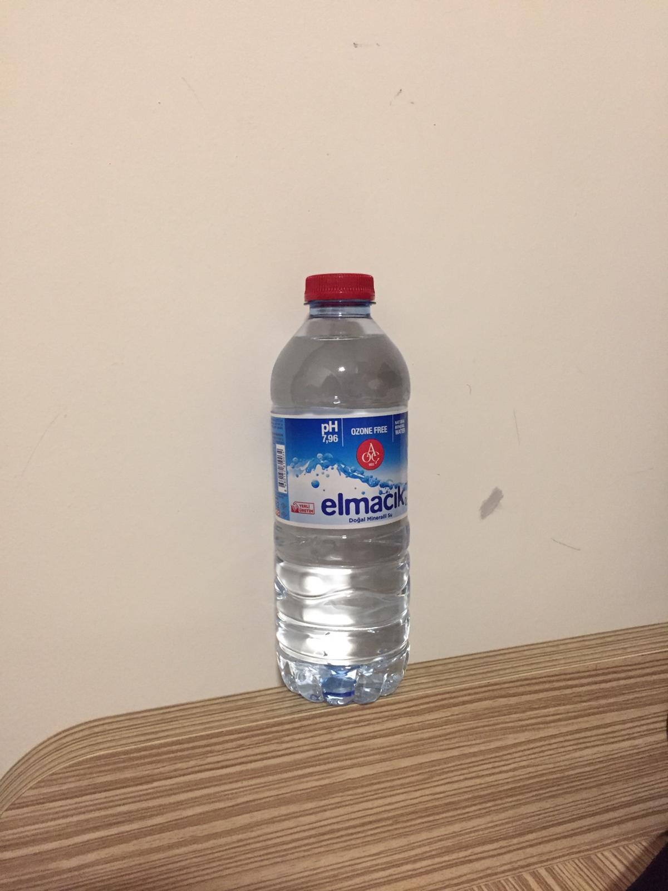

# 🧠 Liquid Detector App

This is a Streamlit web application designed to detect whether a bottle contains **liquid** or is **empty**.

The app is part of a **supervised learning project** led by **Nadia Urban** at **Shanghai Thomas School**, where students learn how to design and deploy machine learning models through hands-on, real-world problems.

---

## 🎓 Project Overview

This project follows five main stages:

1. **Model Design** – Defining the goal: distinguish between filled and empty bottles  
2. **Data Collection** – Gathering images from Baidu and Google  
3. **Model Training** – Using Google’s Teachable Machine to train a CNN classifier  
4. **Model Assessment** – Evaluating prediction accuracy and class balance  
5. **Web App Design** – Deploying the model in a user-friendly Streamlit interface

---

## 🛠️ App Description

This app helps users determine if a bottle image represents a container with **liquid** or **no liquid** (empty), which could be useful in automation, recycling, or inventory control contexts.

### 🧾 Model Information
- **Classes:**
  1. Liquid – A bottle containing fluid  
  2. No liquid – An empty bottle  
- **Goal:** 🎯 To develop a model that can identify whether a bottle is filled or empty  
- **Data Type:** 🖼️ Images of bottles (filled vs. empty)  
- **Data Source:** 🌐 Collected online from **Baidu** and **Google**  
- **Training:** 🏋️ Teachable Machine  
- **Model Type:** 🧠 Convolutional Neural Network (CNN)

---

## 🖼️ Training Data Samples

| Class      | Image Preview     | Number of Training Images |
|------------|-------------------|----------------------------|
| Liquid     |  | 86 photos                  |
| No liquid  |  | 96 photos                  |

(*These preview images are shown in the app sidebar.*)

---

## 👩‍🔬 Model Authors

- **范丝湲 (Andela Fan)**  
- **李佳蔚 (Angela Li)**

---

## ✨ Credits

This project was developed as part of the **AI & Machine Learning program** at **Shanghai Thomas School**, designed and taught by **Nadia Urban**.

---

## 🚀 Deployment

The app is deployed using [Streamlit Cloud](https://streamlit.io/cloud) and can also be run locally by installing the required dependencies:

```bash
pip install streamlit tensorflow pillow numpy
streamlit run app.py
